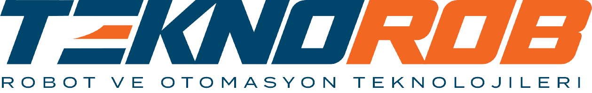

# 🎬 AutoDub Studio v0.0.2 Beta

**AI-Powered Video Dubbing Pipeline** / **Система ИИ-Дубляжа Видео**

Desktop app (Windows 11) for professional AI video translation and dubbing. Fully local or cloud-assisted.

> Source → Demucs → WhisperX → Pyannote → Translate → TTS → MKV
> 14+ languages. Desktop (Tauri v2) + CLI. UI: EN 🇬🇧 / RU 🇷🇺 / TR 🇹🇷

<p align="center">
  
</p>

---

## 🚀 Pipeline

| Step | Technology | Description |
|------|-----------|-------------|
| 📥 **Download** | yt-dlp | YouTube, X, TikTok, local files |
| 🎵 **Voice Isolation** | Demucs (htdemucs_ft) | Studio-quality vocal extraction, auto CPU fallback |
| 📝 **Transcription** | WhisperX / Faster-Whisper | Word-level alignment, 99 languages, CUDA |
| 👥 **Diarization** | Pyannote 3.1 | Speaker identification (requires HF token) |
| 🧠 **Translation** | DeepL → Gemini → DeepSeek → Google → Ollama/Gemma4 | Cascade fallback with AI refinement |
| 🎙️ **TTS** | XTTSv2 / Qwen3-TTS / F5-TTS / Edge-TTS / Azure / OpenAI | 3 local + 3 cloud engines, gender-matched |
| 🎬 **Assembly** | FFmpeg MKV | Multi-track: Dub + Clean + Original + Bilingual SRT |

### 🎙️ TTS Engines

| Engine | Type | Languages |
|--------|------|-----------|
| **XTTSv2** | [local] | ru, en, tr, ar, es, fr, de, zh, ja, ko, it, pt, pl, hi |
| **Qwen3-TTS** | [local] | ru, en, zh, ja, ko, es, de, fr, pt, it |
| **F5-TTS** | [local] | tr, en, zh, ru |
| **Edge TTS** | [internet] | 14 languages (free) |
| **Azure Speech** | [API] | 14 languages |
| **OpenAI TTS** | [API] | 14 languages |

### 🧠 Translation Engines

| Engine | Type | Notes |
|--------|------|-------|
| **Ollama / Gemma4** | [local] | 3 model sizes: 12B, E4B, E2B |
| **DeepL** | [API] | High quality, paid |
| **Google Gemini** | [API] | Context-aware |
| **DeepSeek** | [API] | Affordable |
| **Google Translate** | [internet] | Free, rate-limited |

---

## 🏗️ Architecture

```
AutoDubStudio/
├── backend/
│   ├── main.py                   # FastAPI + WebSocket server
│   ├── translator.py             # Multi-engine cascade (DeepL→Google→Gemma4)
│   ├── vram_manager.py           # Real-time GPU/RAM monitor with auto-cleanup
│   ├── system_optimizer.py       # Windows native memory optimization
│   ├── whisper_multi_worker.py   # WhisperX + Faster-Whisper
│   ├── nlp_splitter.py           # Spacy sentence segmentation
│   ├── glossary_api.py           # User glossary management
│   └── lang_worker.py            # SpeechBrain language detection
├── gui/
│   ├── src/                      # React 19 + Fluent UI v9 + TypeScript
│   │   ├── pages/                # DubbingStudio, LiveSubtitles, AIChat, Settings
│   │   ├── components/           # StatusBar, TimelineEditor, SpeakerManager, etc.
│   │   ├── hooks/                # WebSocket, Ollama, ModelStatus
│   │   └── store.ts              # Global state + i18n (RU/EN/TR)
│   └── src-tauri/                # Rust backend (Tauri v2 + OTA Updater)
├── engine.py                     # Main dubbing pipeline
├── xtts_worker.py                # XTTSv2 voice cloning
├── qwen_worker.py                # Qwen3-TTS voice cloning
├── f5_worker.py                  # F5-TTS voice cloning
├── lip_sync_worker.py            # Audio swap
├── diarization_worker.py         # Pyannote speaker diarization
├── gender_worker.py              # Cross-lingual gender detection
├── cli.py                        # CLI for batch processing
└── live_engine.py                # Real-time subtitle capture
```

---

## 📦 CLI Usage

```bash
# Subtitles only, fully local
python cli.py "video.mp4" --langs ru,tr --dub_engine none

# Full dub with XTTSv2 voice cloning
python cli.py "video.mp4" --langs ru --dub_engine xttsv2

# Qwen3-TTS for Russian
python cli.py "video.mp4" --langs ru --dub_engine qwen3-tts

# F5-TTS for Turkish
python cli.py "video.mp4" --langs tr --dub_engine f5-tts

# YouTube + Google Translate + Edge-TTS
python cli.py "https://youtube.com/..." --langs ru,tr --dub_engine edge-tts

# Quick test (60 seconds)
python cli.py "video.mp4" --langs ru --max_duration 60

# Fully local (no cloud APIs)
python cli.py "video.mp4" --langs ru --local_only
```

### CLI Flags

| Flag | Default | Options |
|------|---------|---------|
| `--langs` | `ru` | Target languages (comma-separated) |
| `--dub_engine` | `xttsv2` | `xttsv2`, `qwen3-tts`, `f5-tts`, `edge-tts`, `azure`, `openai`, `none` |
| `--translator_engine` | `google` | `google`, `ollama`, `deepl`, `deepseek`, `gemini` |
| `--whisper_engine` | `whisperX` | `whisper` (fast), `whisperX` (word-level) |
| `--translator_model` | `gemma4:e4b` | Ollama model for translation |
| `--local_only` | — | Force local AI (no cloud APIs) |
| `--max_duration` | `0` | Trim to N seconds (0 = full) |
| `--device` | `cuda` | `cuda` or `cpu` |

### Output Files

| File | Content |
|------|---------|
| `*_original.srt` | Original transcription with `[EN]` language tags |
| `*_LANG.srt` | Translated subtitles |
| `*_LANG_bilingual.srt` | Original + Translation side-by-side |
| `*_LANG_RU_TR.mkv` | Final video with multi-track audio + subtitles |

---

## 🔧 Environment Diagnostics

15 automated tests cover the entire stack:

```
PyTorch Core ─────── ✅    Coqui TTS / XTTSv2 ── ✅    Ollama API ──────── ✅
TorchAudio ───────── ✅    Demucs ────────────── ✅    yt-dlp ─────────── ✅
Faster-Whisper ───── ✅    Pyannote ──────────── ✅    FFmpeg ─────────── ✅
WhisperX ─────────── ✅    Google Translate ──── ✅    Database Engine ── ✅
F5-TTS ───────────── ✅    Edge TTS ──────────── ✅
Qwen3-TTS ────────── ✅
```

---

## 🛡️ Security

- **API keys**: never leaked to child processes (blacklist filtering)
- **WebSocket auth**: per-session token, bound to 127.0.0.1
- **PII redaction**: automatic in logs and error reports
- **Path traversal protection**: validated output directories
- **SSRF protection**: URL allowlist for YouTube downloads

---

## 📦 Build

### Requirements
- Windows 10/11
- Node.js 20+ · Rust · FFmpeg · Ollama
- Python dependencies are managed automatically via `uv`
- NVIDIA GPU 4+ GB VRAM (recommended)

```bash
git clone https://github.com/LiskinLabs/autodubstudio.git
cd AutoDubStudio/gui

npm install
npm run tauri build
# Installer: gui/src-tauri/target/release/bundle/nsis/
```

### Dev Mode
```bash
cd AutoDubStudio/backend && ..\.venv\Scripts\python.exe main.py  # Backend
cd AutoDubStudio/gui && npm run tauri dev                         # Desktop app
```

---

## 🤝 Author

**Silvestr Liskin** — Senior Automation Engineer / Industrial Robot Programmer
Teknorob Robot ve Otomasyon — Bursa, TR

[GitHub](https://github.com/LiskinLabs) · [GitLab](https://gitlab.com/LiskinLabs)

---

MIT License
