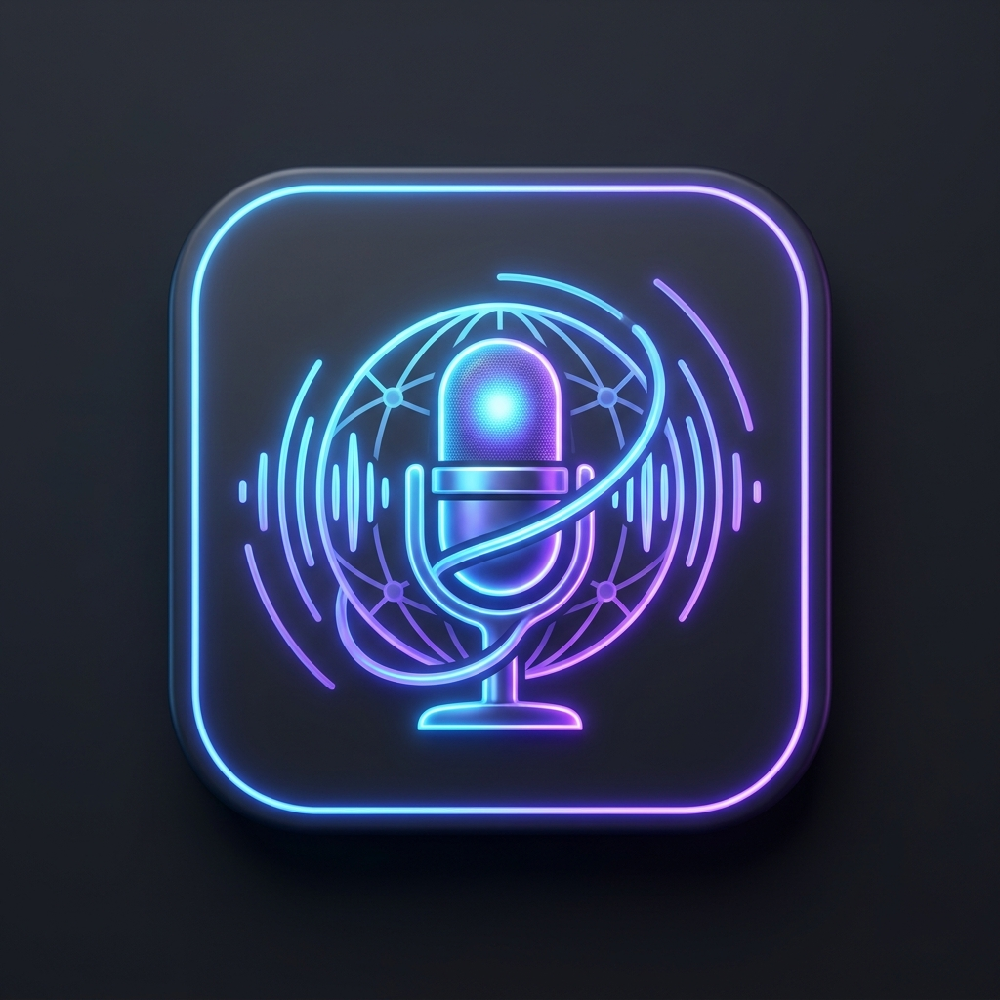

# 🎬 AutoDubStudio

**AI-Powered Video Dubbing Pipeline** — профессиональный дубляж видео с использованием локального ИИ.

> Транскрибация → Перевод (Gemma4 + Google) → Озвучка (14 языков) → Сборка в MKV с субтитрами.
> Всё локально, всё бесплатно.

<p align="center">
  
</p>

---

## 🚀 Возможности

### 🎯 Основной пайплайн

| Шаг | Технология | Описание |
|-----|-----------|----------|
| 🎵 **Изоляция вокала** | Demucs (htdemucs) | Отделение голоса от фона для чистого дубляжа |
| 📝 **Транскрибация** | OpenAI Whisper (small/large-v3) | Распознавание речи с точностью до сегмента |
| 🧠 **ИИ-перевод** | Gemma4 9B (локально) + Google Translate | Двухэтапный: быстрая база → ИИ-рефайн |
| 🎙️ **Озвучка** | 4 движка на выбор | Локальные + облачные голоса |
| 🎬 **Сборка** | FFmpeg MKV | Мультитрековый файл: оригинал + дубляж + субтитры |

### 🌍 Поддерживаемые языки

| Язык | Перевод | Озвучка | Субтитры |
|------|---------|---------|----------|
| 🇷🇺 Русский | ✅ | ✅ DmitryNeural / Qwen3-TTS / XTTSv2 / F5-TTS | ✅ |
| 🇹🇷 Турецкий | ✅ | ✅ AhmetNeural / XTTSv2 / F5-TTS | ✅ |
| 🇬🇧 Английский | ✅ | ✅ ChristopherNeural / Qwen3-TTS / XTTSv2 | ✅ |
| 🇸🇦 Арабский | ✅ | ✅ HamedNeural / XTTSv2 | ✅ |
| 🇪🇸 Испанский | ✅ | ✅ AlvaroNeural / XTTSv2 | ✅ |
| 🇫🇷 Французский | ✅ | ✅ HenriNeural | ✅ |
| 🇩🇪 Немецкий | ✅ | ✅ ConradNeural | ✅ |
| 🇨🇳 Китайский | ✅ | ✅ YunxiNeural | ✅ |
| 🇯🇵 Японский | ✅ | ✅ KeitaNeural | ✅ |
| 🇰🇷 Корейский | ✅ | ✅ InJoonNeural | ✅ |
| 🇮🇹 Итальянский | ✅ | ✅ DiegoNeural | ✅ |
| 🇵🇹 Португальский | ✅ | ✅ DuarteNeural | ✅ |
| 🇵🇱 Польский | ✅ | ✅ MarekNeural | ✅ |
| 🇮🇳 Хинди | ✅ | ✅ MadhurNeural | ✅ |

### 🎙️ Движки озвучки (TTS)

| Движок | Тип | Языки | Голосов | Voice Cloning |
|--------|-----|-------|---------|---------------|
| **Edge-TTS** | Облачный, бесплатный | 14 | 14 нейро-голосов | ❌ |
| **Qwen3-TTS** | Локальный | RU, EN | CustomVoice (Vivian) | ✅ |
| **XTTSv2** | Локальный | Все | Voice cloning из видео | ✅ |
| **F5-TTS** | Локальный | RU, EN, TR, AR | Zero-shot cloning | ✅ |

### 🧠 ИИ-перевод

| Движок | Тип | Качество | Скорость |
|--------|-----|----------|----------|
| **Gemma4 9B** | Локальный (Ollama) | ⭐⭐⭐⭐⭐ | ~30s/сегмент (первый), ~10s (последующие) |
| **Google Gemini** | API | ⭐⭐⭐⭐⭐ | ~2s/батч |
| **DeepSeek** | API | ⭐⭐⭐⭐ | ~2s/батч |
| **Google Translate** | Бесплатный | ⭐⭐⭐ | ~0.5s/сегмент |
| **DeepL** | API | ⭐⭐⭐⭐⭐ | ~1s/сегмент |

**Фишки перевода:**
- 🔄 Двухэтапный: быстрая база (Google) → ИИ-рефайн (Gemma4)
- 📋 Контекстный перевод — соседние сегменты как контекст
- 🛡️ Circuit breaker: если Gemma4 недоступен → Google Translate
- 🧹 Авто-очистка VRAM перед загрузкой модели
- ⚡ `keep_alive` — модель остаётся в GPU между запросами

### 🎬 Выходной формат

**MKV с 7+ дорожками:**
- 🎥 Оригинальное видео (copy, без перекодирования)
- 🔊 Original Audio (English)
- 🔊 RU Dub (дубляж + фон)
- 🔊 RU Clean (чистый дубляж)
- 📝 English Subtitles (Original)
- 📝 Russian Subtitles
- 🔊 TR Dub / TR Clean / TR Subtitles (опционально)

Все дорожки имеют правильные названия и языковые метки.

### 🖥️ Интерфейс

- **Tauri v2 + React 19** — нативный десктоп (Windows)
- **PyQt6** — альтернативный интерфейс
- **Тёмная/светлая тема**
- **3 языка интерфейса:** English, Русский, Türkçe
- **Live Subtitles** — субтитры поверх любых окон (Zoom, Teams, Meet)
- **AI Chat** — чат с локальными моделями
- **YouTube URL** — вставь ссылку → автоматическая загрузка и дубляж

### 🔐 Безопасность

- API-ключи в **Tauri Secure Store** (не localStorage!)
- WebSocket с **token-аутентификацией**
- CORS ограничен конкретными origin
- HTTP-запросы restricted to 15 доменов (Tauri capability)
- Нет `shell=True` в subprocess — защита от инъекций
- Валидация video_path через `os.path.realpath()`
- Авто-отправка ошибок в GitHub Issues

### ⚡ Умная озвучка (Sentence-Aware TTS)

- Группировка сегментов по границам предложений (точка, вопрос, восклицание)
- Одна TTS-генерация на группу → **естественная интонация**
- Разбивка обратно по text-length ratios
- Максимум 8 сегментов в группе
- Без mid-sentence cuts!

---

## 📦 Установка

### Требования

- Windows 10/11
- Python 3.12
- Node.js 20+
- Ollama
- FFmpeg (в PATH)
- NVIDIA GPU с 6+ GB VRAM (рекомендуется) или CPU

### Быстрый старт

```bash
# 1. Клонировать
git clone https://github.com/LiskinLabs/autodubstudio.git
cd autodubstudio

# 2. Python-окружение
python -m venv .venv
.venv\Scripts\activate
pip install -r requirements.txt  # или uv sync

# 3. Модели ИИ
download_models.bat              # → Gemma4 9B (Ollama)

# 4. GUI
cd gui
npm install
npm run tauri dev
```

### Ручной запуск

```bash
# Backend
.venv\Scripts\python.exe backend\main.py

# Frontend (другой терминал)
cd gui && npm run dev
```

---

## 🎮 Использование

### GUI

1. Запусти `Start_AutoDubStudio.bat`
2. Выбери видео (файл или YouTube URL)
3. Настрой: языки, голос, движок перевода
4. Нажми «Start Pipeline»
5. Смотри прогресс в реальном времени
6. Готовый MKV в папке `downloads/`

### CLI

```bash
.venv\Scripts\python.exe cli_run.py
```

### Python API

```python
from engine import AutoDubWorker

config = {
    "video_path": "video.mp4",
    "out_dir": "output/",
    "target_langs": ["ru", "tr"],
    "whisper_model": "small",
    "device": "cuda",
    "translation_engine": "Ollama (Local, Free)",
    "dub_engine": "Edge-TTS (Cloud, Free, Fast)",
    "manual_mode": False,
    "lip_sync": False,
    "tag": "my_project"
}

worker = AutoDubWorker(config)
worker.log_signal.connect(lambda msg: print(msg))
worker.finished_signal.connect(lambda ok, msg: print(f"Done: {msg}"))
worker.run()
```

---

## 🏗️ Архитектура

```
AutoDubStudio/
├── engine.py              # Основной пайплайн (AutoDubWorker)
├── live_engine.py         # Live-субтитры (PyQt6 overlay)
├── cli_run.py             # CLI-раннер
├── backend/
│   ├── main.py            # FastAPI + WebSocket сервер
│   ├── translator.py      # ИИ-перевод (Gemma4, Gemini, DeepSeek, Google)
│   ├── workers.py         # Фоновые задачи
│   └── vram_manager.py    # Управление VRAM
├── gui/                   # Tauri v2 + React 19
│   ├── src/
│   │   ├── pages/         # DubbingStudio, LiveSubtitles, AIChat, Settings
│   │   ├── hooks/         # usePipelineWebSocket, useOllama
│   │   └── store.ts       # Tauri Store (API keys)
│   └── src-tauri/         # Rust backend
├── f5_worker.py           # F5-TTS subprocess worker
├── xtts_worker.py         # XTTSv2 subprocess worker
├── qwen3_worker.py        # Qwen3-TTS subprocess worker
├── diarization_worker.py  # Pyannote speaker diarization
└── models/                # Ollama models directory
```

### Пайплайн (по шагам)

```
YouTube URL / Video File
        │
        ▼
[yt-dlp download]    ← если URL
        │
        ▼
[Demucs htdemucs]    ← изоляция вокала (~15s для 4.5 мин)
        │
        ▼
[Whisper small]      ← транскрибация (~25s, 78 сегментов)
        │
        ├──→ [оригинальные субтитры SRT]
        │
        ▼
[Google Translate]   ← быстрая база (~30s, 78 сегментов)
        │
        ▼
[Gemma4 9B]          ← ИИ-рефайн (батчи по 4, ~120s)
        │               ↓ если Gemma4 недоступен → circuit breaker
        ▼
[Edge-TTS / XTTSv2]  ← sentence-aware группы
        │
        ▼
[FFmpeg MKV mux]     ← видео + аудио + субтитры
        │
        ▼
    🎬 Final.mkv
```

---

## 🔧 Конфигурация

### config.json
```json
{"lang": "tr"}
```

### API-ключи (в GUI Settings)
- Google Gemini API Key
- DeepSeek API Key
- DeepL API Key
- OpenAI API Key
- HuggingFace Token (Pyannote)
- Azure Speech Key

### Переменные окружения
```bash
GITHUB_TOKEN=ghp_...    # Для авто-репортов ошибок в GitHub Issues
```

---

## 🛡️ Безопасность (Security Features)

- **API keys:** Tauri Secure Store (encrypted app data), never in localStorage
- **WebSocket:** token-based auth (`secrets.token_urlsafe(32)`)
- **CORS:** restricted to `localhost:5173`, `localhost:1420`, `tauri://localhost`
- **HTTP permissions:** 15 specific API domains only
- **No shell injection:** all `subprocess.run()` use arrays, never `shell=True`
- **Path validation:** `os.path.realpath()` on all file inputs
- **Auto-cleanup:** temp files deleted after pipeline
- **Error reporting:** automatic GitHub Issues creation via `/api/report-error`
- **No eval/exec/pickle:** verified by SAST scan

---

## 📊 Тесты и бенчмарки

| Видео | Длит. | Языки | TTS | Перевод | Время |
|-------|-------|-------|-----|---------|-------|
| test_20s.mp4 | 20s | RU | Edge-TTS | Google + Gemma4 | 2.3 мин |
| test_20s.mp4 | 20s | TR | Edge-TTS | Google + Gemma4 | 1.5 мин |
| Samsung Dex | 4.5 мин | RU | Edge-TTS | Google + Gemma4 | ~12 мин |
| Samsung Dex | 4.5 мин | RU+TR | Edge-TTS | Google Translate | ~12 мин |
| Samsung Dex | 4.5 мин | TR | XTTSv2 | Google + Gemma4 | ~39 мин |

---

## 🤝 Вклад

Создано [Silvestr Liskin](https://github.com/LiskinLabs) — Senior Automation Engineer, Teknorob Robot ve Otomasyon, Bursa, TR.

[](https://github.com/LiskinLabs/autodubstudio)
[](https://gitlab.com/LiskinLabs/autodubstudio)

---

## 📄 Лицензия

MIT License — см. [LICENSE](LICENSE)
